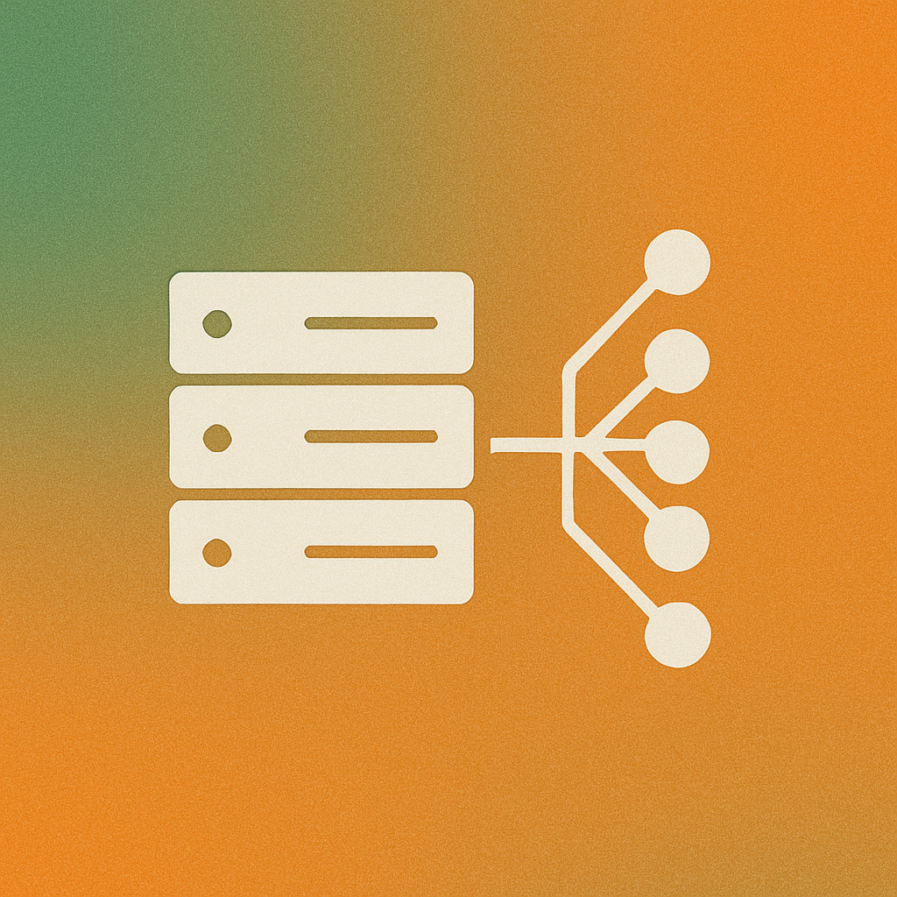

<div align="center">
    <h1> ✨ MCP one – A Unified Hub for MCP Servers </h1>
</div>  

<p align="center">
  
  
  
  
</p>

<p align="center">
<b>MCP one</b> is a lightweight, extensible, and blazing-fast hub to manage multiple MCPs (Model Context Protocol) servers in a single place.  
</p>

<div align="center">

</div>

---

## 🚀 Key Features

✅ **Dynamic Integration:** Add or remove MCP servers simply by editing `config.yaml`.
✅ **M × N → M + N:** Connect clients to a single hub instead of integrating each MCP directly.
✅ **Unified API:** Standardized `/tools`, `/call`, and `/servers` endpoints, regardless of underlying MCP differences.
✅ **Dynamic Endpoint Mapping:** Each MCP can expose custom routes or payloads. Map them with `endpoints`, `response_map`, and `payload_map`.
✅ **Health Monitoring:** Built-in `/health`, `/ready`, and `/status` to monitor all connected servers.
✅ **Operational Hardening (Phase 4):** API-key/Bearer auth, rate limiting, circuit breaker, and Prometheus-friendly metrics.
✅ **Async & Scalable:** Built with FastAPI, `httpx`, and asyncio for top performance.
✅ **Plug & Play:** Works with any MCP server (GitHub MCP, SQL MCP, Jupyter MCP, or your own).

---

## 🏗️ Architecture

```text
           ┌───────────────────┐
           │    MCP one API    │◄──── Clients (LLMs, Apps, Services)
           └─────────┬─────────┘
                     │
      ┌──────────────┼───────────────┐
      │              │               │
┌────────────┐ ┌────────────┐ ┌────────────┐
│ MCP Server │ │ MCP Server │ │ MCP Server │
│   (GitHub) │ │   (SQL)    │ │   (Jupyter)│
└────────────┘ └────────────┘ └────────────┘
```

💡 Each MCP server can define its own routes and payloads.
**MCP Hub normalizes everything.**

---

## ⚡ Getting Started

### 🔧 Prerequisites

* **Python 3.10+**
* A running MCP server (or use the included `dummy_mcp` example)

### 📦 Installation

```bash
git clone https://github.com/<your-user>/mcp-one.git
cd mcp-one
pip install -r requirements.txt
```

---

## ⚙️ Configuration

All server integrations are defined in `src/config.yaml`:

```yaml
servers:
  - name: dummy
    url: http://localhost:7000
    description: Dummy MCP for testing
    enabled: true
    timeout: 30
    retry_attempts: 3
    endpoints:
      health: /health
      tools: /tools
      call: /call
    response_map:
      tools_key: ""                 # empty means the response is a plain list
      tool_name_field: "name"
      tool_desc_field: "description"
    payload_map:
      tool_field: "tool"
      args_field: "arguments"

hub:
  host: "0.0.0.0"
  port: 8000
  debug: true
  log_level: "INFO"
```

---

## 🚦 Running MCP Hub

Start the hub:

```bash
cd src
uvicorn app.main:app --reload
```

**MCP Hub will be available at:**

```
http://localhost:8000
```

---

## 📡 API Reference

| Endpoint           | Method | Description                                   |
| ------------------ | ------ | --------------------------------------------- |
| `/`                | GET    | Root information about the hub                |
| `/health`          | GET    | Health status of the hub                      |
| `/status`          | GET    | Detailed status (servers, uptime, tools)      |
| `/servers`         | GET    | List registered MCP servers                   |
| `/servers/refresh` | POST   | Force refresh of all servers and tools        |
| `/tools`           | GET    | List all available tools (across all servers) |
| `/call`            | POST   | Execute a tool on a specific server           |
| `/ready`           | GET    | Readiness probe for orchestrators             |
| `/metrics`         | GET    | JSON runtime metrics                           |
| `/metrics/prometheus` | GET | Prometheus plaintext metrics                  |

### 🛠 Example: Call a tool

```bash
curl -X POST http://localhost:8000/call \
  -H "Content-Type: application/json" \
  -d '{
    "tool": "dummy.add_numbers",
    "arguments": {"a": "5", "b": "7"}
  }'
```

✅ **Response:**

```json
{
  "success": true,
  "result": {"sum": 12},
  "server_name": "dummy",
  "execution_time_ms": 8.37
}
```

---


## 🔒 Production Security & Reliability (Phase 4)

You can now configure request protection and resiliency controls:

```yaml
hub:
  api_key: "your-shared-key"        # optional
  bearer_token: "your-bearer-token" # optional

rate_limit:
  enabled: true
  requests_per_minute: 100

servers:
  - name: dummy
    url: http://localhost:7000
    retry_attempts: 3
    circuit_breaker_failures: 5
    circuit_breaker_reset_seconds: 30
```

If `api_key` is configured, clients must send `x-api-key`.
If `bearer_token` is configured, clients must send `Authorization: Bearer <token>`.

---

## 🧠 LangChain Integration: Is it a good idea?

Yes — integrating with LangChain is usually a smart next step **if** you need orchestration, memory, and tool routing for multi-step agents.

Good reasons to integrate:
- Reuse MCP one as a single tool gateway for multiple agents.
- Simplify tool discovery (`/tools`) and invocation (`/call`) in agent chains.
- Keep MCP server changes decoupled from your LangChain app.

When to delay:
- If your use-case is single-step and deterministic, direct API usage may stay simpler.
- If latency budget is tight, validate chain overhead first.

Recommended pattern:
1. Wrap MCP one as a custom LangChain Tool provider.
2. Cache `/tools` with refresh TTL.
3. Route all tool calls through `/call` with retry + circuit-breaker awareness.
4. Export `/metrics/prometheus` to your observability stack.

---

## 🧩 Extending MCP Hub

MCP Hub supports **dynamic endpoint mappings**.
To add a new MCP server:

1. Add a new block in `config.yaml` with `endpoints`, `response_map`, and `payload_map`.
2. Restart the hub and refresh:

   ```bash
   curl -X POST http://localhost:8000/servers/refresh
   ```

3. 🎉 Your new tools are now available through `/tools` and `/call`.

---

## 🌟 Why MCP one?

✔️ **Saves Integration Effort:** Forget wiring M×N connections for each client.
✔️ **Centralized Control:** One place to monitor, configure, and call tools.
✔️ **Future-Proof:** Add new MCP servers without changing code.
✔️ **Ready for Scale:** Designed with extensibility and high throughput in mind.

---

## 🤝 Contributing

We welcome contributions!
Check out [CONTRIBUTING.rst](CONTRIBUTING.rst) for guidelines.

---

## 📜 License

This project is licensed under the [MIT License](LICENSE).

---

<p align="center">
Made by Miguel to the Open Source community.
</p>
