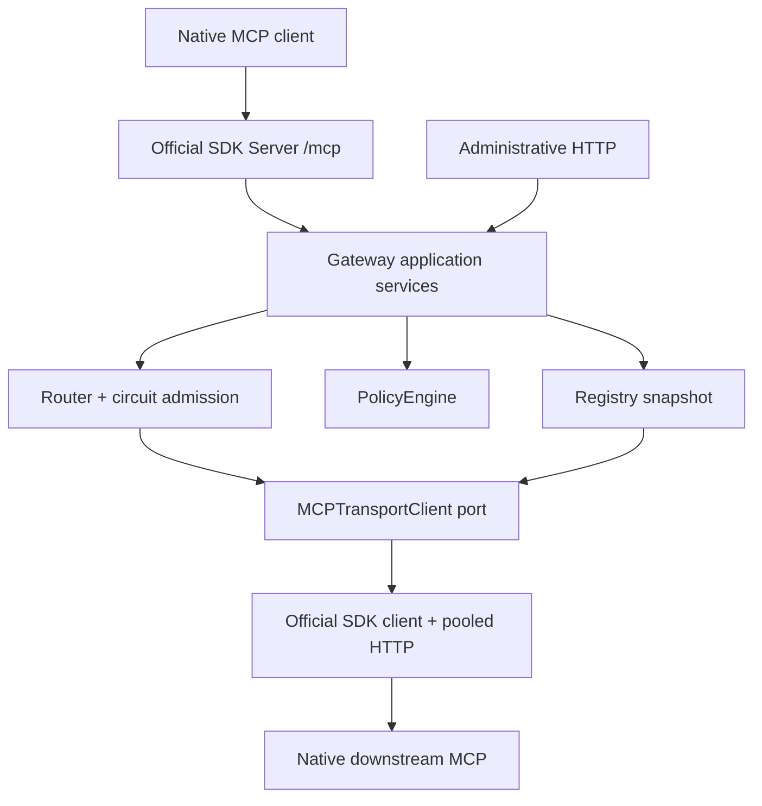

# Architecture

`server.py` is the composition root, not a monolithic router. `config` owns
Pydantic configuration; `domain` holds operational models, error codes and schema
bounds; `application` owns registry, routing, policy, circuits and lifecycle.
`infrastructure` adapts the official SDK; `transport` handles HTTP admission;
`admin` exposes the same application services; `observability` implements metrics.
Application services have no dependency on HTTPX, Starlette Request, YAML or
Prometheus. Native SDK model types form the lossless boundary; dynamic JSON in
schemas and protocol metadata is intentionally typed as SDK JSON, not rewritten
into gateway-specific schema models.

The registry constructs a complete candidate per server, validates schemas and
names, then atomically swaps a frozen snapshot of read-only route/server maps.
A call captures one snapshot and uses its original name, schema and server identity
throughout. Discovery and calls can run concurrently without partial catalogs.
Published Tool objects are owned by their snapshot and never mutated by the core.
A schema/name edit affects subsequent calls, not calls already admitted.

HTTP clients live for the application lifespan. Each SDK operation enters and
exits its own context using the shared HTTP connection pool; no client history is
semantic state. Modern calls adopt the discovery version through the SDK without
a second discovery. Legacy negotiation is provided by the SDK when needed.
A typed `session.send_request(CallToolRequest, CallToolResult)` deliberately
avoids high-level implicit rediscovery and automatic multi-round execution.
The SDK still owns parsing, version checks, headers, trace context and framing.

Startup validates config, creates the pool, discovers catalogs and starts one
refresh/probe supervisor. Shutdown cancels/awaits that supervisor and closes all
HTTP pools. HTTP serving uses SDK lifespan ownership. Telemetry is flushed during
shutdown. Uvicorn bounds graceful request draining to 15 seconds.

State is local to one replica: registry snapshots, circuits, admission counters
and metrics. No user session, result cache, database or external queue exists.
Replicas independently discover servers and enforce circuits; distributed policy
or rate limits require a later design. Resources and multi-round workflows remain
outside this tools-only capability boundary.
